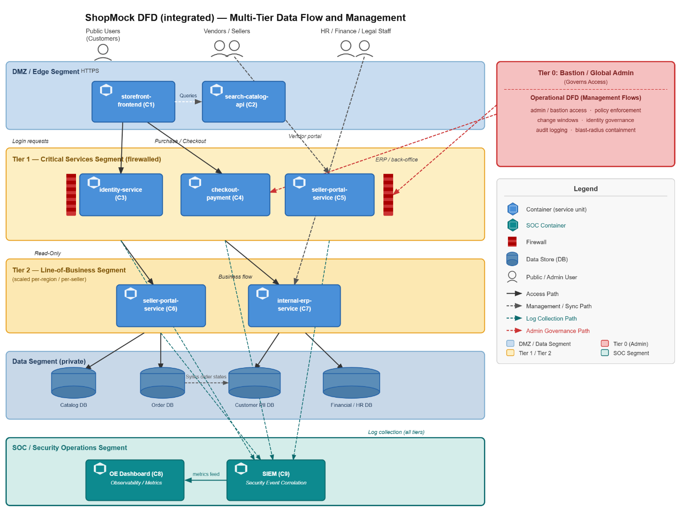

**ShopMock Company**

**Online Shopping Infrastructure Design**

I-Sheng Lee | Capstone: Autonomous AI-Driven Cyber Attacks

*June 2026 | University of Washington*

# **1. Assets (Crown Jewels)**

The following assets represent the highest-value targets within the
ShopMock infrastructure, ordered by business impact and sensitivity. The
identity system is ranked most critical: its compromise grants access to
all other assets.

| **Asset**                            | **Description**                                                                                                |
| ------------------------------------ | -------------------------------------------------------------------------------------------------------------- |
| **Identity System**                  | Login credentials, session tokens, SSO. The key of the kingdom — compromise enables access to everything else. |
| **Customer Info**                    | Accounts, order history, shipping addresses. Primary PII exposure surface.                                     |
| **Money**                            | Payments, stored cards/wallet, revenue data. PCI-DSS scope; highest regulatory risk.                           |
| **Employee PII**                     | HR records, payroll, benefits. Internal sensitive data separate from customer PII.                             |
| **Catalog & Pricing Data**           | Product listings, pricing engine, inventory levels. Competitive and operational sensitivity.                   |
| **Recommendation / Behavioral Data** | Browsing, search, and purchase signals. Behavioral profiling data with privacy implications.                   |

# **2. Business Systems**

Each system below is a candidate for a dedicated service container in
the deployment model.

| **System**                        | **Scope**                                                |
| --------------------------------- | -------------------------------------------------------- |
| **HR**                            | Payroll and employee benefits.                           |
| **Finance**                       | Payments, billing, fraud detection, chargebacks.         |
| **Legal**                         | Compliance, seller agreements, returns policy.           |
| **IT**                            | Internal infrastructure and tooling.                     |
| **DB**                            | Orders, catalog, inventory, and customer databases.      |
| **Vendors / Marketplace Sellers** | Vendor and seller data (owned by vendors, not ShopMock). |
| **Storefront & Search**           | Web/app frontend, search engine, recommendations.        |
| **Order Fulfillment**             | Warehouse, logistics, shipping, tracking.                |
| **Customer Support**              | Tickets, returns, refunds.                               |

# **3. Tier Model (by Access / Business Impact)**

Systems are classified into tiers based on blast radius — the scope of
damage if that system is compromised. Tier 0 is the highest-value and
hardest-to-reach; Tier 2 is the most exposed but lowest-impact.

<table>
<thead>
<tr class="header">
<th><strong>Tier</strong></th>
<th><strong>Examples</strong></th>
<th><strong>Blast Radius</strong></th>
</tr>
</thead>
<tbody>
<tr class="odd">
<td>
<strong>Tier 0</strong>

<em><strong>Identity / Global Admin</strong></em>
</td>
<td>Identity service, global admin, access management</td>
<td>Full platform compromise. Key of the kingdom — bypass means everything else falls.</td>
</tr>
<tr class="even">
<td>
<strong>Tier 1</strong>

<em><strong>Critical Services</strong></em>
</td>
<td>Checkout/payment service, catalog/pricing engine</td>
<td>SolarWinds-style blast radius — impacts all users of checkout or all pricing.</td>
</tr>
<tr class="odd">
<td>
<strong>Tier 2</strong>

<em><strong>Line-of-Business / Customer Data</strong></em>
</td>
<td>A single seller dashboard, regional support tooling</td>
<td>Contained to one seller or region. Significant but isolated.</td>
</tr>
</tbody>
</table>

<table>
<tbody>
<tr class="odd">
<td>
<strong>Blast Radius Principle</strong>

The difference between Tier 1 and Tier 2 is business impact scope: a compromised checkout service (Tier 1) affects every transaction across the platform; a compromised seller dashboard (Tier 2) affects only that seller's data. Tier assignment drives both access controls and the isolation architecture in Section 4.
</td>
</tr>
</tbody>
</table>

# **4. Network Deployment Model**

ShopMock uses a multi-container deployment by default: each system from
Section 2 runs as its own container rather than being bundled onto
shared machines. This ensures failures and access remain isolated per
service.

## **4.1 Tier-to-Container Mapping**

| **Tier**                             | **Container Deployment Strategy**                                                                                                                                             |
| ------------------------------------ | ----------------------------------------------------------------------------------------------------------------------------------------------------------------------------- |
| **Tier 0 — Identity / Global Admin** | Identity and access-management containers run in their own locked-down network segment, reachable only through a bastion/admin path.                                          |
| **Tier 1 — Critical Services**       | Checkout/payment, identity, and catalog/pricing each get dedicated containers, replicated across hosts, in a tightly firewalled segment. Largest blast radius, most isolated. |
| **Tier 2 — Line-of-Business**        | Seller dashboards and regional support tooling run as containers in a separate segment, scaled per region/seller so one tenant's issue cannot reach others.                   |
| **Shared Data Stores**               | Order, catalog, and customer DBs sit behind their owning service containers and are only reachable from those services — never directly from the frontend.                    |

## **4.2 Multi-VM vs. Multi-Container**

| **Dimension**    | **Multi-Container (Default)**                                     | **Multi-VM (Fallback for Tier 0/1)**                                 |
| ---------------- | ----------------------------------------------------------------- | -------------------------------------------------------------------- |
| **Isolation**    | Lighter — shares host kernel. Kernel-level escape is a risk.      | Stronger — separate kernels provide hardware-level isolation.        |
| **Speed & Cost** | Starts in seconds. Many services per host. Low resource overhead. | Heavier — full OS per VM, slower to boot, higher resource cost.      |
| **Scaling**      | Scales and replicates per tier easily. Fits blast-radius model.   | Scales more coarsely. Less flexible for per-tier replication.        |
| **Operations**   | Requires orchestrator (e.g. Kubernetes) and image hygiene.        | More familiar to traditional ops teams. Less orchestration overhead. |

<table>
<tbody>
<tr class="odd">
<td>
<strong>Recommendation</strong>

Multi-container is the better default for ShopMock. Per-service isolation, fast scaling, and clean network segmentation match the tier/blast-radius design. Multi-VM is reserved as a stronger-isolation fallback for the most sensitive Tier 0/Tier 1 workloads (payment, identity) where hardware-level separation justifies the extra cost.
</td>
</tr>
</tbody>
</table>

# **5. Network Distribution Diagram**

The diagram below illustrates how containers are distributed across
network segments. Each segment is accessible only through defined
ingress paths, with Tier 0 reachable exclusively via the bastion/admin
route.

<table>
<tbody>
<tr class="odd">
<td>
<em>[Network Distribution Diagram — to be inserted]</em>

External → DMZ → Tier 2 Segment → Tier 1 Segment → Tier 0 Segment, with Shared DBs behind Tier 1/2 services.
</td>
</tr>
</tbody>
</table>

# **6. Robustness Analysis**

This section assesses the strength of the ShopMock design, the
assumptions it depends on, and how sensitive the security posture is to
those assumptions failing.

## **6a. What Makes This Design Robust**

  - **Per-service isolation:** One service = one container. A compromise
    or failure is contained to that service rather than the whole host.

  - **Tiered blast radius:** Tier 0/1/2 segmentation means a breach of a
    low-tier component cannot directly reach identity or payment
    systems.

  - **Data behind services:** Shared DBs are only reachable through
    their owning service, not the frontend, blocking direct data
    exfiltration from an exposed web tier.

  - **Bastion/admin path for Tier 0:** Identity/admin is reachable only
    through a controlled path, shrinking the attack surface for the
    highest-value target.

## **6b. Assumptions the Design Relies On**

  - **Shared host kernel:** Container isolation assumes no kernel
    escape. If the kernel/orchestrator is vulnerable, per-service
    boundaries weaken. Mitigation: VM-level isolation for Tier 0/1.

  - **Correct network segmentation:** Robustness depends on firewall
    rules and segment boundaries being enforced exactly as designed. A
    single mis-scoped rule collapses a tier boundary.

  - **Orchestrator security:** Kubernetes (or equivalent) becomes a Tier
    0-class target itself. Compromising the control plane bypasses most
    per-service isolation.

  - **Image & supply-chain hygiene:** The model assumes trusted images.
    A poisoned base image undermines isolation regardless of
    segmentation.

  - **Identity system integrity:** Since identity is the key of the
    kingdom, the whole tier model depends on it not being bypassed
    (token theft, SSO misconfiguration).

## **6c. Failure Modes and Sensitivity**

<table>
<tbody>
<tr class="odd">
<td>
<strong>Most Sensitive To</strong>

Kernel/orchestrator compromise and identity-system compromise. Either can defeat the segmentation globally, bypassing all tier boundaries simultaneously.
</td>
</tr>
</tbody>
</table>

<table>
<tbody>
<tr class="odd">
<td>
<strong>Least Sensitive To</strong>

Failure of an individual Tier 2 container — well contained by design. A compromised seller dashboard cannot propagate to checkout or identity.
</td>
</tr>
</tbody>
</table>

Conclusion: the design is robust conditional on correct segmentation
enforcement, a hardened orchestrator, and strong identity. Where those
cannot be guaranteed (payment/identity), fall back to VM-level
isolation.

## **6d. Comparison to a Real Large Retailer (e.g. Amazon)**

| **Property**                           | **ShopMock**                                                                      | **Large Retailer (e.g. Amazon) — Source**                                                                                                                                                        |
| -------------------------------------- | --------------------------------------------------------------------------------- | ------------------------------------------------------------------------------------------------------------------------------------------------------------------------------------------------ |
| **Architectural primitives**           | Microservice-per-container, network segmentation, privileged-access tiering       | Amazon decomposed its monolith into a 'fully-distributed, decentralized, services platform' of hundreds of independent services. \[6\]                                                           |
| **Identity-centric tiered access**     | Tier 0 identity reachable only via controlled path                                | AWS treats IAM and identity as highest-privilege Tier 0; compromise of the control plane leads to total cloud environment takeover. \[7\]                                                        |
| **Blast-radius containment**           | Tier 0/1/2 segmentation; Tier 2 cannot reach Tier 0/1                             | Blast-radius containment via least-privilege IAM and per-service isolation is a documented AWS and cloud-security practice; limiting identity permissions limits what attackers can reach. \[8\] |
| **Data-behind-services**               | DBs reachable only through their owning service, never directly from the web tier | AWS Prescriptive Guidance: 'Individual data stores cannot be directly accessed by other microservices — persistent data is accessed only by APIs.' \[9\]                                         |
| **Horizontal scaling**                 | Container replication per tier without changing security boundaries               | Large e-commerce platforms use microservice-level horizontal scaling to handle Black Friday surges without changing security boundaries, fine-grained per-service. \[10\]                        |
| **Operational layers (honest caveat)** | Not yet specified in this design                                                  | 24/7 SOC, automated anomaly detection, dedicated red teams, hardware roots of trust, edge DDoS scrubbing — operational maturity, not structural difference.                                      |

<table>
<tbody>
<tr class="odd">
<td>
<strong>Honest Caveat</strong>

ShopMock's architecture is structurally equivalent to a large retailer's. The gap is operational maturity, not structural design: Amazon's strength is roughly 80% operations (SOC, detection, IR, threat intel, red teams) plus identity maturity layered on top of the same architectural primitives. Closing that gap is a roadmap item, not a redesign.
</td>
</tr>
</tbody>
</table>

# **References**

**\[1\] Microsoft** Enterprise Access Model — Privileged Access Tier
0/1/2.
[*https://learn.microsoft.com/en-us/security/privileged-access-workstations/privileged-access-access-model*](https://learn.microsoft.com/en-us/security/privileged-access-workstations/privileged-access-access-model)

**\[2\] NIST SP 800-207** Zero Trust Architecture.
[*https://csrc.nist.gov/publications/detail/sp/800/207/final*](https://csrc.nist.gov/publications/detail/sp/800/207/final)

**\[3\] NIST SP 800-190** Application Container Security Guide.
[*https://csrc.nist.gov/publications/detail/sp/800/190/final*](https://csrc.nist.gov/publications/detail/sp/800/190/final)

**\[4\] CIS Kubernetes Benchmark** Orchestrator Hardening Guidelines.
[*https://www.cisecurity.org/benchmark/kubernetes*](https://www.cisecurity.org/benchmark/kubernetes)

**\[5\] SolarWinds (2020)** Supply-chain compromise — blast-radius
lesson.
[*https://www.cisa.gov/news-events/alerts/2020/12/17/active-exploitation-solarwinds-software*](https://www.cisa.gov/news-events/alerts/2020/12/17/active-exploitation-solarwinds-software)

**\[6\] Vogels, W. (2006)** A Conversation with Werner Vogels: Learning
from the Amazon technology platform. ACM Queue, Vol. 4, No. 4. Describes
Amazon's decomposition from a two-tier monolith into a
fully-distributed, decentralized services platform of hundreds of
independent services..
[*https://queue.acm.org/detail.cfm?id=1142065*](https://queue.acm.org/detail.cfm?id=1142065)

**\[7\] AWS Security Blog** Privileged Access — AWS IAM and identity as
Tier 0 control plane. Compromise of the control plane can lead to total
cloud environment takeover..
[*https://aws.amazon.com/blogs/security/tag/privileged-access/*](https://aws.amazon.com/blogs/security/tag/privileged-access/)

**\[8\] Blast Security (2025)** Reducing the Blast Radius: A Practical
Guide to Containing Cloud Risk Before It Spreads. Documents how
least-privilege IAM and per-service isolation limit attacker reach..
[*https://blast.security/blog/reducing-the-blast-radius-a-practical-guide-to-containing-cloud-risk-before-it-spreads/*](https://blast.security/blog/reducing-the-blast-radius-a-practical-guide-to-containing-cloud-risk-before-it-spreads/)

**\[9\] AWS Prescriptive Guidance** Database-per-service pattern.
States: 'Individual data stores cannot be directly accessed by other
microservices — persistent data is accessed only by APIs.'.
[*https://docs.aws.amazon.com/prescriptive-guidance/latest/modernization-data-persistence/database-per-service.html*](https://docs.aws.amazon.com/prescriptive-guidance/latest/modernization-data-persistence/database-per-service.html)

**\[10\] Shukla, R. (2024)** Scaling for Surges: How E-Commerce Giants
Handle Black Friday & Big Billion Day Traffic. Describes
microservice-level horizontal container scaling without changing
security boundaries..
[*https://dev.to/ravikantshukla/scaling-for-surges-how-e-commerce-giants-handle-black-friday-big-billion-day-traffic-32o4*](https://dev.to/ravikantshukla/scaling-for-surges-how-e-commerce-giants-handle-black-friday-big-billion-day-traffic-32o4)
